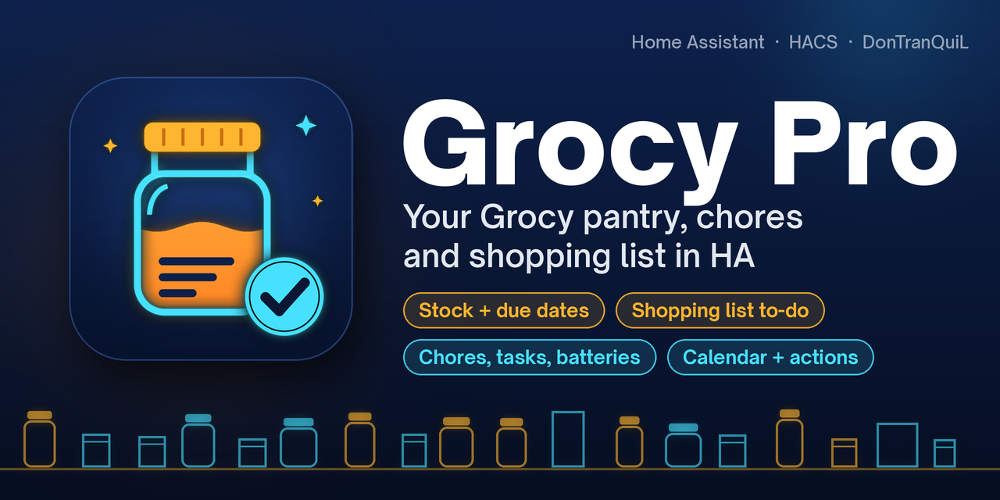
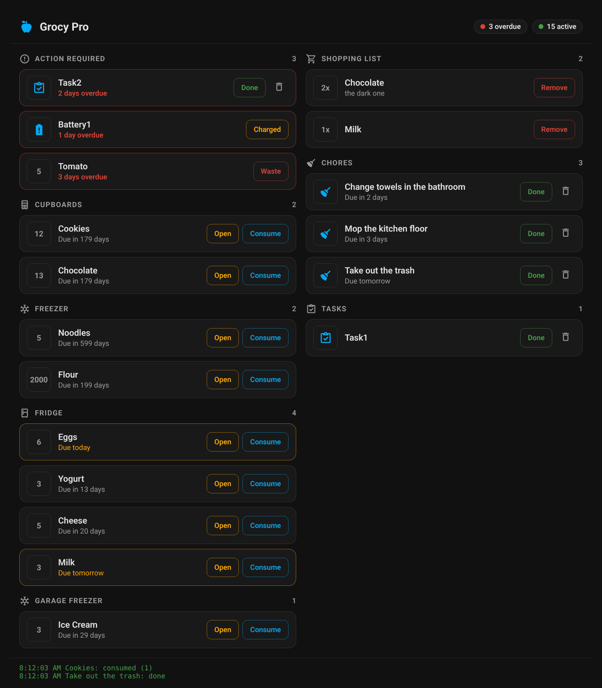

<div align="center">



<br>

**[Grocy](https://grocy.info) in Home Assistant: stock and due dates, the shopping list as a to-do list, chores, tasks, batteries, the meal plan and Grocy's calendar, plus actions and a one-tap dashboard card.**

[](https://my.home-assistant.io/redirect/hacs_repository/?owner=DonTranQuiL&repository=grocy-pro&category=integration)
[](https://my.home-assistant.io/redirect/config_flow_start/?domain=grocy_pro)

[](https://github.com/DonTranQuiL/grocy-pro/releases)
[](https://hacs.xyz)
[](https://www.home-assistant.io/)
[](https://grocy.info)
[](LICENSE)

[](https://github.com/DonTranQuiL/grocy-pro/actions/workflows/pytest.yml)
[](https://github.com/DonTranQuiL/grocy-pro/actions/workflows/hass-ci.yml)
[](https://github.com/DonTranQuiL/grocy-pro/actions/workflows/hassfest.yaml)
[](https://github.com/DonTranQuiL/grocy-pro/actions/workflows/hacs.yaml)
[](https://github.com/DonTranQuiL/grocy-pro/actions/workflows/codeql.yml)
[](https://github.com/astral-sh/ruff)
[](https://discord.gg/qaHPTTKHae)
[](https://ko-fi.com/DonTranQuiL)

[Dashboard card](#dashboard-card) · [Install](#installation) · [Upgrading from 2.x](#upgrading-from-2x-the-grocy-domain) · [Entities](#entities) · [Actions](#actions) · [Examples](#automation-examples) · [Troubleshooting](#troubleshooting) · [Docs site](https://dontranquil.github.io/grocy-pro/)

</div>

## Highlights

| | |
| --- | --- |
| 🥫 **Stock at a glance** | Everything in stock, plus binary sensors for products that are expiring, overdue, expired or below their minimum stock. |
| 🛒 **Shopping list as a to-do list** | Check items off in the supermarket, add products by name, remove items. Works with Assist and the to-do card. |
| 🧹 **Chores, tasks and batteries** | Counts with the full lists as attributes, and "overdue" binary sensors for automations. |
| 📅 **Calendar** | Grocy's own calendar (due products, chores, tasks, batteries, meal plan) as a Home Assistant calendar. |
| ⚡ **13 actions** | Purchase, consume, open, track chores and batteries, complete tasks, consume recipes, manage the shopping list, edit any Grocy object, and add a whole receipt by product name. |
| 🃏 **Dashboard card included** | The Grocy Pro Command Center card loads automatically. No resource to add. |
| 🪶 **Light on your server** | Polls Grocy's cheap "database changed" endpoint every 30 s and only downloads data when something changed (or every 5 minutes so due dates roll over). |
| 🔐 **Clean setup** | UI setup with connection check, re-authentication when the API key stops working, reconfigure, diagnostics with the key and URL redacted. |
| 🇳🇱 **English and Dutch** | The UI and actions are translated into both. |

## Dashboard card



The **Grocy Pro Command Center** card shows what needs attention (overdue tasks, expired products, batteries to charge), your stock by location, the shopping list, chores and tasks, with one-tap buttons: done, open, consume, waste, charged, remove. It is loaded by the integration, so there is no resource to add: pick it in the card picker or paste this:

```yaml
type: custom:grocy-action-card
```

All options are optional:

```yaml
type: custom:grocy-action-card
title: Kitchen            # header text (default: Grocy Pro)
locations:                # Grocy location ID -> name
  1: Pantry               # defaults: 1 Pantry, 2 Fridge, 3 Freezer, 4 Cupboards
  5: Garage
entity_prefix: grocy      # if you renamed the entities, e.g. sensor.kitchen_stock -> kitchen
show_pictures: true       # product pictures from Grocy
show_log: true            # short log of the actions you took, with errors
confirm_delete: true      # ask before the bin icon deletes a task or chore in Grocy
```

`title`, `entity_prefix` and the switches can also be set in the visual editor. The card follows your Home Assistant theme (light or dark), switches to one column on narrow screens and works in Sections, Masonry and Panel views. An item disappears right after you tap it; the integration refreshes its data straight after every action.

## Installation

### HACS (recommended)

Click **Open in HACS** above, or add the repository yourself:

1. HACS → ⋮ → **Custom repositories**
2. URL: `https://github.com/DonTranQuiL/grocy-pro`, category **Integration**
3. Download **Grocy Pro**, then restart Home Assistant

### Manual

Copy `custom_components/grocy_pro` to `/config/custom_components/` and restart Home Assistant.

## Configuration

1. In Grocy, create an API key: **Settings (wrench) → Manage API keys → Add**.
2. In Home Assistant: **Settings → Devices & services → Add integration → Grocy Pro** (or the **Add integration** button above).
3. Fill in:

| Field | Example | Notes |
| --- | --- | --- |
| URL | `http://192.168.1.10` or `https://grocy.example.com/grocy` | Include `http://` or `https://`. A port or sub path in the URL is fine. |
| API key | | From step 1. |
| Port | `9192` | The Grocy add-on uses 9192. Behind a reverse proxy use 443 (or 80). Ignored when the URL already has a port. |
| Verify SSL certificate | off | Turn on when Grocy has a valid HTTPS certificate. |

Grocy Pro checks the connection before saving. Change it later with entry → ⋮ → **Reconfigure**.

> [!TIP]
> Using the **Grocy add-on**? Open the add-on's **Configuration** tab and enter `9192` under **Network** to expose the API port, then use `http://<your HA IP>` with port `9192`.

Only one Grocy server can be added. Entities for features you've turned off in Grocy (for example batteries or the calendar) are not created.

## Upgrading from 2.x (the `grocy` domain)

Up to 2.x this repository installed into `custom_components/grocy` with the domain `grocy`. That is the same folder and domain as the original [custom-components/grocy](https://github.com/custom-components/grocy) integration, which HACS has since removed from its default list. Because of that, HACS kept showing **"Repository removed from HACS / The repository owner has removed it"** for your installation, even though this repository is alive and yours.

3.0 gives the integration its own domain, **`grocy_pro`**, so it can never be mixed up with the old one again.

1. **Restart Home Assistant first.** HACS works out the install folder of a repository when Home Assistant starts. Without a restart it still uses the old `custom_components/grocy` path, and the download fails with *"No manifest.json file found 'custom_components/grocy/manifest.json'"* (or empties the old folder without installing anything).
2. **Download Grocy Pro 3.x in HACS** (open the repository, it may still be called *Grocy*: ⋮ → **Redownload** → latest version). It installs into `custom_components/grocy_pro`. If it still fails, use the [HACS fix](#hacs-download-fails-with-the-old-grocy-path) below.
3. **Restart Home Assistant** again.
4. **Settings → Devices & services → Add integration → Grocy Pro.** Grocy Pro sees your old Grocy setup and offers **Move my old Grocy setup**. Pick it: Grocy Pro reuses the URL and API key, removes the old Grocy entry and sets itself up.
5. **Update your automations and scripts**: actions are now called `grocy_pro.*` instead of `grocy.*` (search and replace `grocy.` → `grocy_pro.` in your action calls).
6. **Remove the old card resource**: if you added `/local/grocy-action-card.js` under **Settings → Dashboards → Resources**, delete it and the file in `/config/www/`. The card now comes with the integration. Your `type: custom:grocy-action-card` cards keep working.

7. **Clean up HACS and the old folder.** If HACS still lists the old *Grocy* (`custom-components/grocy`) as removed, choose **Remove** there. Delete `/config/custom_components/grocy` if it is still there (empty or not), then restart once more.

### HACS download fails with the old grocy path

HACS keeps the domain (`grocy`) and the folder it computed for this repository in memory until Home Assistant restarts. If a download fails with *"No manifest.json file found 'custom_components/grocy/manifest.json'"*, or `custom_components/grocy` ended up empty and there is no `custom_components/grocy_pro`:

1. In HACS, open the repository → ⋮ → **Remove**.
2. Delete `/config/custom_components/grocy` if it is still there.
3. **Restart Home Assistant.**
4. HACS → ⋮ → **Custom repositories** → add `https://github.com/DonTranQuiL/grocy-pro` as *Integration*, then download Grocy Pro.
5. **Restart Home Assistant** and continue with step 4 above.

What stays the same:

- **Entity IDs.** The device is still called *Grocy*, so you get `sensor.grocy_stock`, `binary_sensor.grocy_overdue_chores` and so on again, with their history. (Step 4 removes the old entities first so the IDs are free.) The one exception is the to-do list, which is now `todo.grocy_shopping_list` instead of `todo.grocy_grocy_shopping_list`.
- **Attributes** used by the card and templates (`products`, `chores`, `tasks`, `meals`, ...).

Skipped step 4 and set Grocy Pro up manually? Then delete the old Grocy entry, and rename any entities that ended up with a `_2` suffix.

## Entities

All entities belong to the **Grocy** device.

| Entity | ID | State | Attributes |
| --- | --- | --- | --- |
| Stock | `sensor.grocy_stock` | Products in stock | `products` (name, amount, best before, picture URL, ...) |
| Shopping list | `sensor.grocy_shopping_list` | Items on the list | `products` |
| Chores | `sensor.grocy_chores` | Chores | `chores` (name, next execution, assigned user, ...) |
| Tasks | `sensor.grocy_tasks` | Open tasks | `tasks` |
| Batteries | `sensor.grocy_batteries` | Batteries | `batteries` |
| Meal plan | `sensor.grocy_meal_plan` | Planned meals from today | `meals` (with recipe and picture URL) |
| Expiring products | `binary_sensor.grocy_expiring_products` | On if any product is due soon | `expiring_products`, `count` |
| Overdue products | `binary_sensor.grocy_overdue_products` | On if any product is past its due date | `overdue_products`, `count` |
| Expired products | `binary_sensor.grocy_expired_products` | On if any product is expired | `expired_products`, `count` |
| Missing products | `binary_sensor.grocy_missing_products` | On if any product is below its minimum stock | `missing_products`, `count` |
| Overdue chores | `binary_sensor.grocy_overdue_chores` | On if a chore is overdue | `overdue_chores`, `count` |
| Overdue tasks | `binary_sensor.grocy_overdue_tasks` | On if a task is overdue | `overdue_tasks`, `count` |
| Overdue batteries | `binary_sensor.grocy_overdue_batteries` | On if a battery needs charging | `overdue_batteries`, `count` |
| Shopping list | `todo.grocy_shopping_list` | Items still to buy | |
| Calendar | `calendar.grocy_calendar` | Next event | |

The lists are not recorded in the database (only the counts are), so they don't bloat your history. Product and recipe pictures are served through Home Assistant at `/api/grocy_pro/...`, so they also work outside your home network.

## Actions

| Action | What it does | Main fields |
| --- | --- | --- |
| `grocy_pro.add_product_to_stock` | Purchase: add stock | `product_id`, `amount`, `price` |
| `grocy_pro.consume_product_from_stock` | Consume or waste stock | `product_id`, `amount`, `spoiled`, `transaction_type` |
| `grocy_pro.open_product` | Mark stock as opened | `product_id`, `amount` |
| `grocy_pro.add_products_by_name` | Add several products by name, e.g. from a receipt | `items: [{name, amount, price}]` |
| `grocy_pro.execute_chore` | Track a chore | `chore_id`, `done_by`, `track_execution_now`, `skipped` |
| `grocy_pro.complete_task` | Complete a task | `task_id` |
| `grocy_pro.track_battery` | Track a battery charge | `battery_id` |
| `grocy_pro.consume_recipe` | Consume all ingredients of a recipe | `recipe_id` |
| `grocy_pro.add_missing_products_to_shopping_list` | Put everything below minimum stock on a list | `list_id` |
| `grocy_pro.remove_product_in_shopping_list` | Remove a product from a list | `product_id`, `list_id`, `amount` |
| `grocy_pro.add_generic` | Create any Grocy object | `entity_type`, `data` |
| `grocy_pro.update_generic` | Edit any Grocy object | `entity_type`, `object_id`, `data` |
| `grocy_pro.delete_generic` | Delete any Grocy object | `entity_type`, `object_id` |

The IDs are the numbers in Grocy's URLs (for example `.../product/12`) and in the entity attributes. `add_products_by_name` matches names case-insensitively and also accepts a name that uniquely contains (or is contained in) one product name. Names it can't match are skipped and reported in the error.

Chores are tracked at their scheduled time by default (like the original integration). Set `track_execution_now: true` to track them now.

## Automation examples

Tap an NFC tag to feed the dog and tick off the chore:

```yaml
automation:
  - alias: "Grocy: NFC tap - feed the dog"
    triggers:
      - trigger: tag
        tag_id: YOUR_TAG_ID
    actions:
      - action: grocy_pro.consume_product_from_stock
        data:
          product_id: 42
          amount: 1
      - action: grocy_pro.execute_chore
        data:
          chore_id: 15
          track_execution_now: true
```

Morning notification when something expires:

```yaml
automation:
  - alias: "Grocy: expiring food"
    triggers:
      - trigger: time
        at: "08:00:00"
    conditions:
      - condition: state
        entity_id: binary_sensor.grocy_expiring_products
        state: "on"
    actions:
      - action: notify.mobile_app_your_phone
        data:
          title: "🥫 Use these soon"
          message: >
            {{ state_attr('binary_sensor.grocy_expiring_products', 'expiring_products')
               | map(attribute='name') | join(', ') }}
```

Add a receipt with an AI model (any AI task / generate content integration that returns JSON):

```yaml
script:
  grocy_receipt:
    alias: "Grocy: add receipt"
    sequence:
      - action: google_generative_ai_conversation.generate_content
        data:
          prompt: >
            Read this grocery receipt. Return ONLY JSON like
            {"items": [{"name": "Milk", "amount": 2, "price": 1.29}]}.
            Use these product names where possible:
            {{ state_attr('sensor.grocy_stock', 'products') | map(attribute='name') | join(', ') }}
          filenames:
            - /media/receipt.jpg
        response_variable: ai
      - action: grocy_pro.add_products_by_name
        data: "{{ ai.text | from_json }}"
```

Put everything below minimum stock on the shopping list every Saturday:

```yaml
automation:
  - alias: "Grocy: weekly shopping list"
    triggers:
      - trigger: time
        at: "09:00:00"
    conditions:
      - condition: time
        weekday: sat
    actions:
      - action: grocy_pro.add_missing_products_to_shopping_list
```

## How it works

Grocy Pro talks to the [Grocy REST API](https://demo.grocy.info/api) through [grocy-py](https://github.com/iamkarlson/grocy-py) (bundled in `vendor/`, so it never clashes with the grocy-py version of the old Grocy integration):

- Every 30 s it asks `/system/db-changed-time`. Only when that changes (or after 5 minutes) it downloads stock, the volatile stock (one call for expiring, overdue, expired and missing products), the shopping list, chores, tasks, batteries and the meal plan.
- The calendar is read from Grocy's iCal feed every 15 minutes.
- After every action the data is refreshed straight away.

A daily [API watcher](.github/workflows/ai-feed-watcher.yml) runs the same calls against the public [Grocy demo](https://demo.grocy.info) (always the latest Grocy release) and opens an issue if a new Grocy version breaks something.

## Troubleshooting

| Problem | Fix |
| --- | --- |
| HACS says *"Repository removed from HACS"* / *"The owner has removed it"* | That message is about the custom-components/grocy entry HACS still has on record, not this repository. Follow [Upgrading from 2.x](#upgrading-from-2x-the-grocy-domain) and remove that entry in HACS. |
| HACS: *"No manifest.json file found 'custom_components/grocy/manifest.json'"* | HACS still uses the old folder. See [HACS download fails with the old grocy path](#hacs-download-fails-with-the-old-grocy-path). |
| *cannot import name 'EntityType' from 'grocy'* (3.0.0), or a raw *restart_required* when adding Grocy Pro (3.0.1) | The old Grocy integration's grocy-py 0.1.0 clashed with Grocy Pro's. Update to 3.0.2 or newer: Grocy Pro now brings its own copy of grocy-py and works next to the old integration. |
| *Cannot reach Grocy* | Check the URL and port from Home Assistant's point of view. For the add-on, expose port 9192 (see the tip above). |
| *That address answered, but not like a Grocy server* | Wrong port or sub path, or a login page in front of Grocy. Open `<url>:<port>/api/system/info` in a browser: it should show JSON. |
| *Grocy rejected the API key* / re-authenticate | Create a new API key in Grocy and enter it. |
| Some entities are missing | The matching feature is turned off in Grocy (`FEATURE_FLAG_*` in Grocy's config). |
| Entities have a `_2` suffix | The old `grocy` entities still existed. See the last paragraph of the upgrade section. |
| Card shows *Custom element doesn't exist* | Hard-refresh the browser (Ctrl+Shift+R), or clear the app cache on your phone. |
| Card looks old or says *"Nothing here ??"* | An old copy of the card (from 2.x) is still loaded and wins. Grocy Pro shows a repair for this under **Settings > System > Repairs**. Remove the `/local/grocy-action-card.js` resource (Settings > Dashboards > ⋮ > Resources) and `/config/www/grocy-action-card.js`, then reload. |
| Times in the calendar are off by your UTC offset | Set Grocy's timezone (the `TZ` / PHP timezone of the Grocy container) to your local zone. |

Debug logs:

```yaml
logger:
  logs:
    custom_components.grocy_pro: debug
    grocy: debug
```

Or download diagnostics from the entry (the API key and URL are redacted).

## Related repositories

- **[grocy-rewrite](https://github.com/DonTranQuiL/grocy-rewrite)** was an earlier work-in-progress rewrite (it still uses the old `grocy` domain). Grocy Pro 3.0 is the maintained version; don't install both.
- **[custom-components/grocy](https://github.com/custom-components/grocy)** is the original integration this project started from. It is no longer in the HACS default list.

## Credits

- [Grocy](https://grocy.info) by Bernd Bestel: "ERP beyond your fridge"
- [grocy-py](https://github.com/iamkarlson/grocy-py) by George Green (iamkarlson) and contributors (MIT), the Python client underneath
- The original Home Assistant integration [custom-components/grocy](https://github.com/custom-components/grocy) and its maintained fork [iamkarlson/grocy](https://github.com/iamkarlson/grocy) (Apache-2.0), whose entity model and service names Grocy Pro keeps for compatibility. See [NOTICE](NOTICE).
- Built and maintained by [DonTranQuiL](https://github.com/DonTranQuiL)

## Support

- Docs: [dontranquil.github.io/grocy-pro](https://dontranquil.github.io/grocy-pro/)
- Issues: [GitHub Issues](https://github.com/DonTranQuiL/grocy-pro/issues)
- Community: [Discord](https://discord.gg/qaHPTTKHae)
- Tip jar: [Ko-fi](https://ko-fi.com/DonTranQuiL)

## License

MIT, see [LICENSE](LICENSE). Parts derived from Apache-2.0 projects are credited in [NOTICE](NOTICE).
